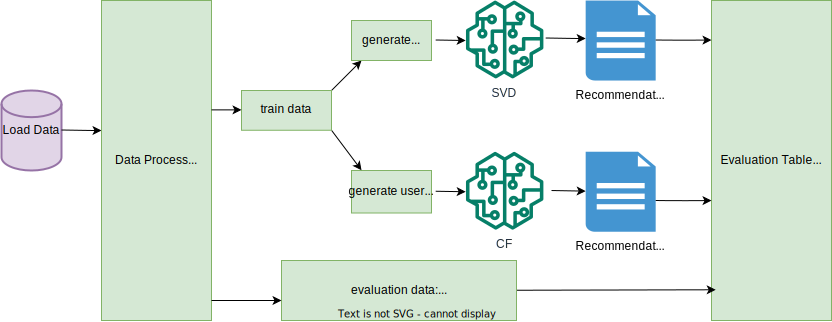

# Product Recommendation System
This Python project is a powerful product-based recommendation engine designed to boost customer engagement and drive business growth. By analyzing user behavior, product features, and purchase history, it delivers personalized product suggestions.


This repository contains a recommendation engine developed using two techniques:

- **Singular Value Decomposition (SVD)** - A matrix factorization method for extracting latent features.
- **Collaborative Filtering (CF)** - A popular recommendation technique based on user-item interactions.

The goal of this recommendation system is to predict products a user may be interested in by analyzing past behavior and similar users' interactions with products.

### Key Features
- **Product Recommendations**: Suggests products based on user preferences.
- **SVD and CF Algorithms**: Implements both matrix factorization (SVD) and collaborative filtering techniques for generating recommendations.
- **Model Evaluation**: Uses metrics like recall to evaluate the performance of the recommendation system.

### Workflow

The following diagram represents the workflow of the recommender system:



Before going into explaination of this workflow lets fetch the git repository containing code and prepare the enviornment.

### How to Run?

#### Prerequisites
Make sure you have Conda installed. If you don’t have it yet, you can download it from [Anaconda's website](https://www.anaconda.com/products/distribution) or install it via Miniconda.

**Step 1: Clone the Repository**

To get started, clone this repository:

```bash
git clone https://github.com/umushtaq1990/product-recommendation-engine.git

cd product-recommendation-engine
```

**Step 2: Create Conda Environment**

Create a new Conda environment with the name specified in the .yml file.

```bash
conda env create -f environment/environment.yml
```
Now, your environment is set up, activate the enviornment.


### Project Directory Structure

Below is the directory structure for the recommender system project:

📂 recommender-system

    │── 📄 README.md # Project documentation

    │── 📂 data # Dataset folder
        ├── 📄 interactions.csv # User interactions data
        ├── 📄 items.csv # Items metadata

    │── 📂 environment # contain files to set enviornment
        ├── 📄 environment.yml # yaml file containing required packages

    │── 📂 src # Source code folder
        ├── 📄 main.py # main script
        │── 📂 rec_engine # Source code folder
            ├── 📄 config.toml # configuration file
            ├── 📄 version.py # contains package version
            │── 📂 code # Source code folder
                ├── 📄 data_loader.py # handles data loading/fetching
                ├── 📄 data_processor.py # used for data cleaning
                ├── 📄 model.py # contain ml algorithims
                ├── 📄 evaluation.py # evaluate prediction results
                ├── 📄 config.py # handles config file
                ├── 📄 pipeline.py # integrate modules
        │── 📂 tests # Unit tests
            │── 📂 .test_data # folder containing sample test datsets
            ├── 📄 conftest.py # pytest configuration file
            ├── 📄 test_data_processor.py # contain unit tests for data processer module
            ├── 📄 test_modeling.py # contain unit tests for modling module
            ├── 📄 test_evaluator.py # contain unit tests for evaluation module

    │── 📂  documentation # Diagrams and visualizations
        ├── 📄 workflow.svg # Workflow diagram

    │── 📂 deployment # Deployment-related files
        ├── 📄 Dockerfile # Docker configuration
        ├── 📄 app.py # API endpoint
        ├── 📄 config.yaml # Configuration file

### Data
Use this link to download movies.csv and ratings.csv files: https://www.kaggle.com/datasets/nicoletacilibiu/movies-and-ratings-for-recommendation-system?select=ratings.csv

### Data Loader Workflow

The DataLoader module is designed to load data from various sources, including Azure ML registered data components, Azure Blob Storage, and local files. It ensures that data is efficiently loaded from the most appropriate source and made available for further processing and analysis. The module also includes functionality to upload data to Azure Blob Storage if it was initially loaded from a local directory. For more details check [`data_loader.md`](documentation/data_loader.md).


### Contributing
If you have any suggestions or improvements for this project, feel free to fork the repository and submit a pull request.

#### Steps to contribute:
- Fork the repository.
- Create a new branch (git checkout -b feature/your-feature).
- Make your changes and commit (git commit -am 'Add feature').
- Push the branch (git push origin feature/your-feature).
- Create a pull request.


e.g: If evaluaton data
contain 100 users,
those 100 users are
checked for
recommendations
generated
by different models
by taking into account
top n recommended
results.If 70 users
newly taken product matches with
recommended results, recall
score for that model
will be 0.7


Author: Usman Mushtaq
Data Scientist / Data Engineer / Data Analyst
Email: usmanmushtaq1990@gmail.com
